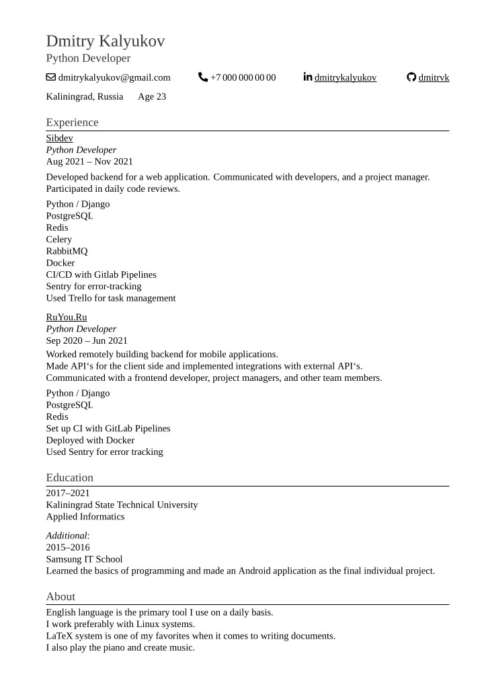

# Resume

## Build

Install LaTeX with *latexmk* and run `make`.
This will produce *DmitryKalyukov.pdf*.

You can change the output file name in the [Makefile](./Makefile).

Run `make clean` to remove auxiliary files created by LaTeX.

## Edit Online

1. Log in to [Overleaf](https://www.overleaf.com) and create a new blank project.
1. In *Menu* select *XeLaTeX* compiler.
1. Replace LaTeX code with the contents from [resume.tex](./resume.tex).
1. Recompile the project.
